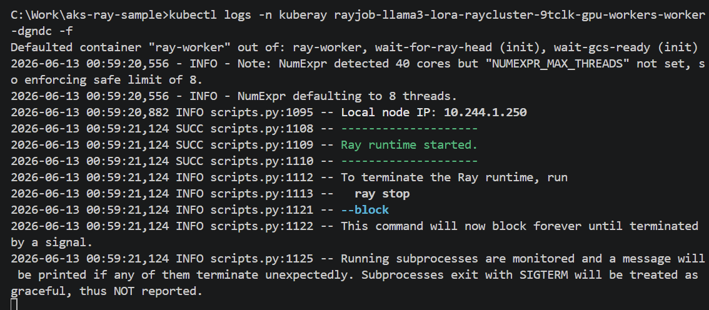
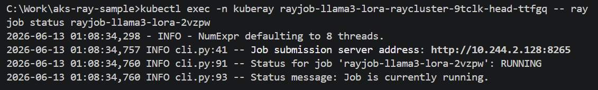
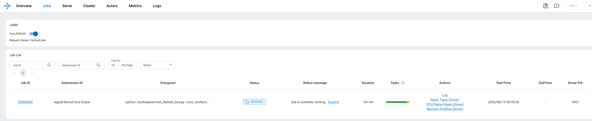
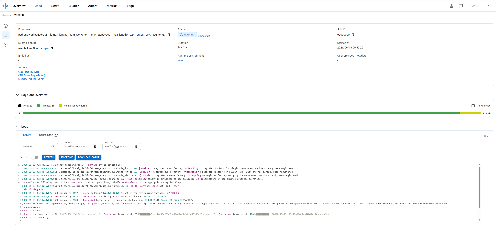
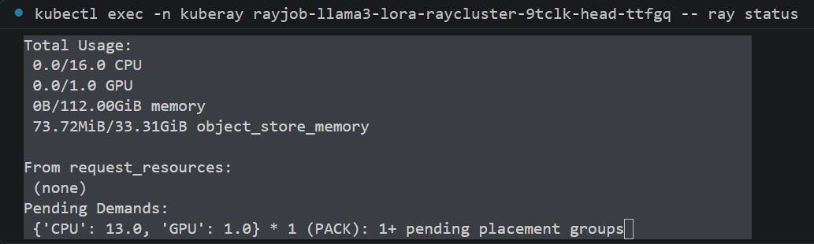

# Llama 3 finetune on Ray cluster

## detailed steps
kubectl create secret generic hf-token   -n kuberay   --from-literal=HF_TOKEN=<your-huggingface-token>
把本地训练脚本上传到集群里作为配置文件存起来:
kubectl create configmap llama3-train-script  -n kuberay  --from-file=train_llama3_lora.py=sample-tuning-setup/train_llama3_lora.py

当前 rayjob-llama3-lora.yaml 用 emptyDir 挂载 /results，适合先验证训练链路。Pod 删除后结果会消失；后续要长期保存再接 Azure Blob/Azure Files PVC。

当前 RayJob 设置了 shutdownAfterJobFinishes: true；训练结束后 KubeRay 会关闭临时 RayCluster，GPU worker Pod 删除后，Karpenter NodePool 的 WhenEmpty 策略会在节点空闲约 5 分钟后回收 GPU node。注意：如果结果还在 emptyDir，删除 RayJob/RayCluster 前必须先拷出 /results/llama3-lora。

提交rayjob:
kubectl apply -n kuberay -f sample-tuning-setup/rayjob-llama3-lora.yaml

查看状态：
kubectl get rayjob -n kuberay
kubectl get pods -n kuberay

查看日志：
kubectl logs -n kuberay -l ray.io/node-type=head -f

kubectl get events -n kuberay --sort-by=.lastTimestamp

kubectl logs -n kuberay rayjob-llama3-lora-jcwf2 -f
kubectl get events -n kuberay --sort-by=.lastTimestamp
kubectl describe pod rayjob-llama3-lora-jcwf2 -n kuberay

kubectl exec -n kuberay rayjob-llama3-lora-raycluster-9tclk-head-ttfgq -- ray job status rayjob-llama3-lora-2vzpw
kubectl exec -n kuberay rayjob-llama3-lora-raycluster-9tclk-head-ttfgq -- ray job logs rayjob-llama3-lora-2vzpw

Delete rayjob and resubmit it:
kubectl delete rayjob rayjob-llama3-lora -n kuberay --ignore-not-found; kubectl apply -n kuberay -f .\sample-tuning-setup\rayjob-llama3-lora.yaml; kubectl get pods -n kuberay

### Check rayjob status and progress
Check worker pod:
kubectl logs -n kuberay rayjob-llama3-lora-raycluster-9tclk-gpu-workers-worker-dgndc -f

查看rayjob status:
kubectl exec -n kuberay rayjob-llama3-lora-raycluster-9tclk-head-ttfgq -- ray job status rayjob-llama3-lora-2vzpw

kubectl get rayjob rayjob-llama3-lora -n kuberay -o jsonpath="{.status.jobDeploymentStatus}{'`n'}{.status.jobStatus}{'`n'}{.status.message}{'`n'}"

看 Ray cluster 资源
kubectl exec -n kuberay rayjob-llama3-lora-raycluster-9tclk-head-ttfgq -- ray status

打开 Ray Dashboard
get head service:
kubectl get svc -n kuberay
kubectl port-forward -n kuberay svc/rayjob-llama3-lora-raycluster-9tclk-head-svc 8265:8265

然后浏览器打开：http://127.0.0.1:8265

get ray job submission id:
kubectl exec -n kuberay rayjob-llama3-lora-raycluster-9tclk-head-ttfgq -- ray job list

查看ray job 日志：
kubectl exec -n kuberay rayjob-llama3-lora-raycluster-9tclk-head-ttfgq -- ray job logs rayjob-llama3-lora-2vzpw

Sample issue:
Ray job is running, pod is in normal status, however GPU utilizaition is 0
原因：
查看ray status看到ray里有一个pending placement group:
kubectl exec -n kuberay rayjob-llama3-lora-raycluster-5xfw6-head-bwd6b -- ray status

Ray 里有一个 pending placement group：{'CPU': 13.0, 'GPU': 1.0} * 1 (PACK)，但 GPU worker 只向 Ray 注册了 12 CPU + 1 GPU。所以 Ray 一直等一个“同一节点上 13 CPU + 1 GPU”的位置，放不下，训练 worker 没启动，GPU 自然是 0。我要把训练请求的 CPU 降下来，让它能落到这个 GPU worker 上。

解决方案：
修改ray job python 文件和ray job yaml 文件将每个训练 worker 的 CPU 请求从 12 降到 10；这样 Ray 的 bundle 加上额外开销也能放进当前 12 CPU + 1 GPU 的 worker 节点。然后刷新 ConfigMap 并重启 RayJob，当前这轮已经卡在不可调度状态：
kubectl delete configmap llama3-train-script -n kuberay --ignore-not-found
kubectl create configmap llama3-train-script -n kuberay --from-file=train_llama3_lora.py=.\sample-tuning-setup\train_llama3_lora.py
kubectl delete rayjob rayjob-llama3-lora -n kuberay --ignore-not-found
kubectl apply -n kuberay -f .\sample-tuning-setup\rayjob-llama3-lora.yaml
kubectl get pods -n kuberay
